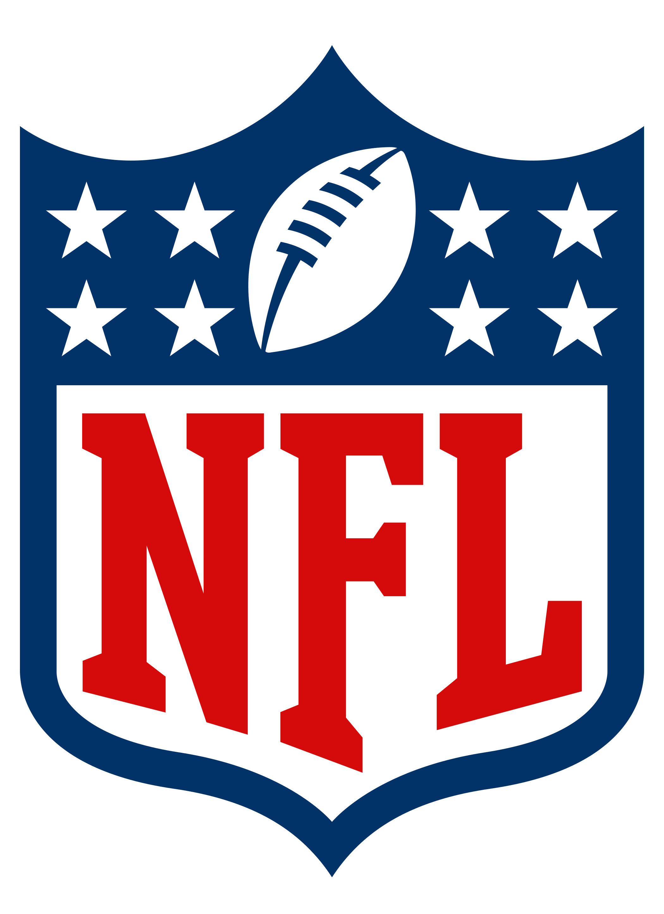

# NFL Play Predictor
This is a machine learning model used to predict whether a play will be a PASS or a RUN, given the current game state.
<p align="center">
    
</p>

## Data
The model uses data scraped from the NFL on every play from the 2019-2020 season. The data was taken from [https://github.com/ryurko/nflscrapR-data/tree/master](https://github.com/ryurko/nflscrapR-data/tree/master). All plays other than PASS and RUN were removed from the training data. The reason being that other plays such as PUNT or FIELD GOAL are obvious when they happen in a game, and aren't an interesting question to solve.

## Getting Started
1. Clone repository
```
git clone https://github.com/mattanikiej/NFL-Play-Predictor
```
2. Enter repository directory
```
cd NFL-Play-Predictor
```
3. Run any of the files with the models
```
python3 feed_forward_nn.py
```

## Models
The project uses three different models:
1. K-Means Clustering
2. Feed Forward Neural Network
3. LSTM Recurrent Neural Network

Note for all confusion matrices, top left is true RUN, bottom right is true PASS
## K-Means
* Uses two clusters
* Higher accuracy when using only 5 of the many features in the data
* Accuracy: 0.526
* Precision: 0.604
* Recall: 0.547
* F-Score: 0.574
* Confusion Matrix:

| RUN | PASS |
|--------------|-----------|
| 666 | 670 |
| 848 | 1025 |


## Feed Forward Neural Network
* 27 feature input
* 2 hidden layers with 64 hidden units and ReLU activation
* Output layer has softmax activation on 2 outputs
* NLLLoss, Adam Optimizer
* Accuracy: 0.701
* Precision: 0.757
* Recall: 0.736
* F-Score: 0.747
* Confusion Matrix:

| RUN | PASS |
|--------------|-----------|
| 2138 | 1118 |
| 1250 | 3488 |


## LSTM Recurrent Neural Network
* Entire game is a sample
* Only use first 100 plays per game
* BCE Loss, Adam Optimizer
* Accuracy: 0.647
* Precision: 0.680
* Recall: 0.764
* F-Score: 0.720
* Confusion Matrix:

| RUN | PASS |
|--------------|-----------|
| 1012 | 1108 |
| 726 | 2354 |
